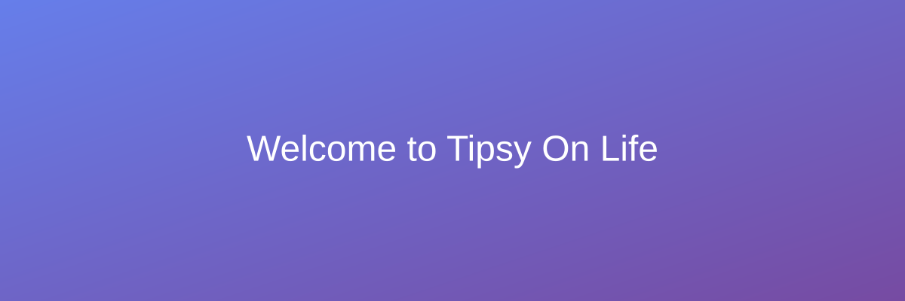

# Welcome to Tipsy On Life

  

## About This Site

Welcome to **Tipsy On Life** - your personal space for sharing thoughts, ideas, and experiences. This website is built with modern web technologies to provide you with the best reading experience possible.

### Features

!!! info "Responsive Design"
    This website is fully responsive and works seamlessly across all devices - desktop, tablet, and mobile.

!!! success "Accessibility First"
    We've designed this site with accessibility in mind, ensuring everyone can enjoy the content.

!!! note "Light & Dark Mode"
    Toggle between light and dark themes using the icon in the top right corner. Your preference is saved automatically!

## What You'll Find Here

### 📝 Blog
Explore thoughtful articles, stories, and insights. The blog section is regularly updated with fresh content covering various topics.

[Visit the Blog](blog/index.md){ .md-button .md-button--primary }

### 📧 Contact
Want to get in touch? Head over to the contact page to send a message or connect through social media.

[Contact Me](contact.md){ .md-button }

## Latest Updates

  <h3>Welcome to Our New Website!</h3>
  
<em>Posted: January 2024</em>

  
We're excited to launch our new website built with MkDocs and Material theme. Explore the blog for more content!

  <a href="blog/posts/welcome.md">Read more →</a>

  <h3>Getting Started with Our Platform</h3>
  
<em>Posted: January 2024</em>

  
Learn how to navigate the site and make the most of all the features we offer.

  <a href="blog/posts/getting-started.md">Read more →</a>

## Stay Connected

Follow along for regular updates and new content. Use the theme toggle at the top to switch between light and dark modes, and enjoy a comfortable reading experience that adapts to your preferences.

---

  Thanks for visiting! 🎉

